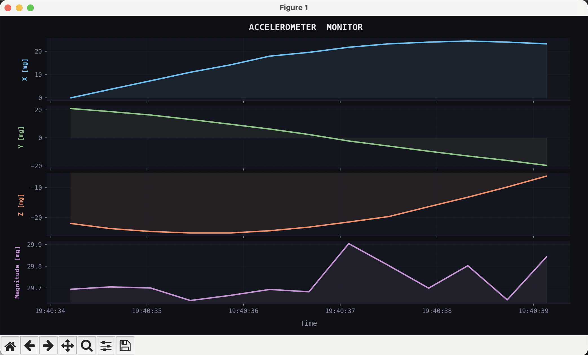

# Sensor Playground - Accelerometer Sampler and Plotter
> Matthew Fonken | Mar 1, 2026 | 8S FE Take Home

---
## Table of Contents

- [Overview](#overview)
- [Repository Structure](#repository-structure)
- [Firmware Application (`firmware_app`) [C]](#firmware-application-firmware_app)
  - [Application Overview](#application-overview)
  - [Source Structure](#source-structure)
  - [Unit Testing with Unity](#unit-testing-with-unity)
  - [Building & Debugging in VS Code](#building--debugging-in-vs-code)
- [Python Client Application (`client_app`) [Python]](#python-client-application-client_app)
  - [Application Overview](#application-overview-1)
  - [Module Descriptions](#module-descriptions)
  - [Python Unit Testing](#python-unit-testing)
- [Sample Communication Protocol](#sample-communication-protocol)
- [CLI](#cli)
- [Data Formats](#data-formats)
- [Getting Started](#getting-started)
- [License](#license)

---

## Overview

This repository aims to visualize sensor (accelerometer) reading in real-time. The firmware app runs a super loop with timer ISR to sample an accelerometer via I2C and send over TCP. Samples are sent to the client app for file logging and/or plotting.

---

## Repository Structure

```
project-root/
├── firmware_app/
│   ├── src/
│   │   ├── main.c
│   │   ├── app.h
│   │   ├── app.c
│   │   ├── comm/
│   │   ├── common/
│   │   ├── filters/
│   │   └── sensors/
│   └── test/
│       ├── Unity/              # Unity submodule
│       └── test_*.c
├── client_app/
│   ├── client_app.py
│   ├── tcp_client.py
│   ├── sample_processor.py
│   ├── accel_plotter.py
│   └── tests/
│       └── test_*.py
├── .vscode/
│   ├── launch.json
│   └── tasks.json
└── README.md
```

---

## Firmware Application (`firmware_app`) [C]

### Application Overview

The firmware samples an sensor (accelerometer) synchronously, formats, filters, serializes and sends over a TCP connection to the client app. 

#### Entry Point: `main` → `app`

Execution begins in `main.c`, which performs low-level hardware initialisation (clocks, peripherals, etc.) before handing control to the application layer. The `app` module is the top-level application controller — it owns the main loop and coordinates all subsystems.

```
main()
 └── app_init()
 └── app_do_work()      ← process sample
 └── app_run()          ← main loop: Dequeue, work, serialize, send
```
---

### Source Structure

All production source code lives under `firmware_app/src/`.

#### `comm/`
Handles all communication interfaces (e.g. I2C, TCP). Responsible for communicating with accelerometer and packaging and transmitting data to external consumers such as the Python client.

#### `common/`
Shared utilities: Circular queue, error, fixed type, and sample.

#### `filters/`
Signal processing and filtering logic (e.g. IIR filter). Operates on raw sensor data to produce clean, usable samples.

#### `sensors/`
Sensor driver and abstraction layer. Handles hardware-level read and control.

---

### Unit Testing with Unity

Unit tests are located in `firmware_app/test/` and use the [Unity](https://github.com/ThrowTheSwitch/Unity) C testing framework, included as a Git submodule.

#### Cloning Unity as a Submodule

When cloning this repository for the first time, initialise and update all submodules to pull in Unity:

```bash
# Clone the repo and initialise submodules in one step
git clone --recurse-submodules https://github.com/<your-org>/<your-repo>.git

# Or, if you have already cloned without submodules
git submodule update --init --recursive
```

Unity will be checked out into `firmware_app/test/Unity/`.

#### Test Coverage

Unit tests exist for each major component:

| Test File | Module Under Test |
|-----------|------------------|
| `test_accelerometer.c` | `sensor/accelerometer.c` |
| `test_app.c` | `.` |
| `test_circular_queue.c` | `common/circular_queue.c` |
| `test_sample.c` | `common/sample.h` |

---

### Building & Debugging in VS Code

This project is configured as a **Visual Studio Code** workspace. All build and debug tasks are defined in `.vscode/`.

#### Compiling with Clang (`tasks.json`)

The C firmware is compiled using **Clang**, configured in `.vscode/tasks.json`. Use the keyboard shortcut: `Ctrl+Shift+B` / `Cmd+Shift+B`.

#### Running & Debugging (`launch.json`)

Debug configurations for both the **C firmware tests** and **Python client** are defined in `.vscode/launch.json`. To launch a debug session:

1. Open the **Run and Debug** panel (`Ctrl+Shift+D` / `Cmd+Shift+D`)
2. Select and play a configuration from the dropdown.

Breakpoints, watch expressions, and the debug console work as expected for both C and Python targets.

---

## Python Client Application (`client_app`) [Python]



### Application Overview

The Python client connects to the firmware over TCP, receives a stream of data samples, and can save them to disk and/or display them in a live plot. Threading is used throughout to keep I/O, processing, and rendering decoupled.

```
client_app.py  (entry point, thread management)
 ├── tcp_client.py       → TCP samples receiving thread
 └── sample_processor.py → dequeues samples → file output
        └── accel_plotter.py → live plot
```

---

### Module Descriptions

#### `client_app.py`
The application entry point. Responsible for:
- Starting TCP client thread
- Starting the sample processing thread
- Running the graph/plotter on the main thread

#### `tcp_client.py`
Opens a TCP connection to the firmware application and listens for incoming sample data. Each received sample is jsonified, framed and placed onto a thread-safe queue for downstream consumers.

#### `sample_processor.py`
Dequeues samples from the shared queue and performs post-processing. Can optionally write samples to an output file (txt with jsonified samples) for offline analysis. Runs in its own thread.

#### `accel_plotter.py`
Ingests samples and renders them in a live scrolling plot (e.g. using `matplotlib`). Displays x, y, z, & magnitude values vs. time upto N (default 5) seconds ago.

---

### Python Unit Testing

Unit tests for the Python client are located in `client_app/tests/` and use the standard `unittest` framework (or `pytest` — update as appropriate).

#### Running Tests

```bash
# From the repository root
cd client_app

# Using pytest (recommended)
pytest tests/ -v

# Or using unittest directly
python -m unittest discover -s tests -v
```

#### Running via VS Code Debugger

Python unit tests can also be run and debugged directly from VS Code using the launch configuration defined in `.vscode/launch.json`:

1. Open the **Run and Debug** panel (`Ctrl+Shift+D` / `Cmd+Shift+D`)
2. Select `Test Client App`

This allows breakpoints to be set inside both test code and the modules under test.

#### Test Coverage

| Test File | Module Under Test |
|-----------|------------------|
| `test_sample_processor.py` | `sample_processor.py` |
| `test_sample_plotter.py` | `sample_plotter.py` |

---
## Sample Communication Protocol
Samples are serialized and communicated as json on the firmware side for easy of use and debugging. 
#### Structure:

| Field    | Type    |
|----------|---------|
| index    | uint32_t |
| x        | float    |
| y        | float    |
| z        | float    |
| mag      | float    |

Example: `{"index":0, "x":24.4155, "y":-12.9636, "z":-13.2077, "mag":29.8027}`

NOTE: The client app may append values to samples such as `timestamp` before saving.

---

## CLI
This app can be controlled by a basic CLI:
| CMD | Description |
|-----|-------------|
|  1  | CONITNUE / START |
|  2 |  PAUSE / STOP|
|  3 | Get STATUS |

Input commands on the python terminal: 
- Press command number
- Press enter

---

## Data Formats
| Field    | Type    | Reasoning |
|----------|---------|-----------|
| Sensor Raw | `int16_t` | Min represenation of 12b 2s complement |
| Sensor Scaled [mg] | `Q16.16` | The scaled samples in g or mg of range +/-5000 fit well within `Q16.16` with good decimal precision. `Q16.16` by default, see `firmware_app/src/common/fixed_type.h:FIXED_SHIFT` for configuration|
| Output Samples | `json` | See above [Sample Communiation Protocol](#sample-communication-protocol)|
---

## Assumptions
| Assumption  | Reasoning | Effect    |
|----------|---------|------|
| Max 32b Types    | Common for MCUs | Constrained conversions and precision |
| `netinet/in.h` & `poll.h` are available | For TCP mock | Constrains deployment versatility |
| User will correctly set endianness | Needs to match real registers (e.g. accelerometer) | User must set `accelerometer.h:ACCEL_VALUE_ENDIAN` (same for other configurations)|

---

## Getting Started

```bash
# 1. Clone with submodules
git clone --recurse-submodules https://github.com/<your-org>/<your-repo>.git
cd <your-repo>

# 2. Install Python dependencies
pip install -r client_app/requirements.txt

# 3. Open in VS Code
code .

# 4. Run `Test Firmware App` in VS Code

# 5. Run `Client App (Python)` in VS Code

# NOTE: Running `Firmware App (C)` on a mock system will not receive timer_isr triggers and have no data.
```

---
